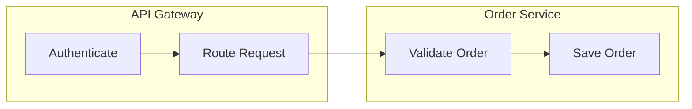
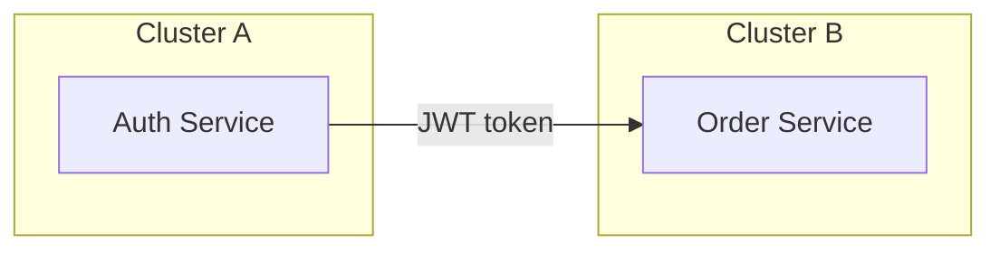

# Mermaid Diagram Authoring

You write Mermaid diagrams — text-based specifications that render into SVG graphics. Your output must read as **clear documentation** — diagrams that any team member (developer, architect, product owner, stakeholder) can understand without deciphering cryptic node IDs or tangled arrows.

## Before You Write Anything

1. Read `references/mermaid-syntax.md` for the **complete diagram type reference, keyword catalogue, and structural rules**.
2. Read `references/best-practices.md` for **style rules, anti-patterns, and the CLEAR principles**.
3. Apply every rule below on top of those references.

## Core Principles (Non-Negotiable)

### 0. Mandatory: Validate Every Diagram Before You Deliver It

A diagram that does not parse is worse than no diagram — it renders as a broken-syntax error box. **Every Mermaid diagram you produce or edit MUST be passed through the `validate-mermaid` validator before you present it.** This is not optional and applies every time, including small edits.

`validate-mermaid` is a command on your `PATH`. It runs the **real Mermaid parser** (`mermaid.parse()` — the exact grammar the renderer uses, run headless), so it catches every syntax error Mermaid itself would reject, with line numbers, across all diagram types. It reads a diagram on **stdin** (raw Mermaid or Markdown containing ```mermaid fences) and:

- exits `0` with **empty output** when the diagram parses, or
- exits `1` and prints the parser's error (line number + what it expected) to **stderr**.

Run it by piping the exact diagram text you intend to deliver:

```bash
validate-mermaid <<'MMD'
flowchart LR
  req[Receive Request] --> validate[Validate Input]
  validate --> respond[Send Confirmation]
MMD
```

You can also pass file paths instead of stdin: `validate-mermaid diagram.mmd README.md` (each ```mermaid block in a Markdown file is validated separately).

**Workflow:**
1. Write the diagram.
2. Pipe it through `validate-mermaid`.
3. If it exits non-zero, **read the stderr message, fix the diagram, and re-validate.** Repeat until it passes.
4. Only then present the diagram to the user.

This is the genuine Mermaid grammar — if it passes, the diagram renders. Still apply every authoring rule below: the parser guarantees the diagram is *valid*, the rules make it *good*.

> If `validate-mermaid` is not found on `PATH`, ask the user what to do. Do not skip validation without user consent.

### 1. Readable Node Labels — Zero Cryptic IDs

Diagrams are **communication tools**, not code artefacts. Every visible label must use plain, meaningful language.

**Forbidden as visible labels:**
- Single-letter IDs: `A`, `B`, `C`
- Abbreviations without context: `svc`, `proc`, `mgr`, `ctrl`, `hdlr`
- Technical jargon when business language exists: `msg_queue` when "Order Queue" works
- Implementation details when describing behaviour: `POST /api/v2/orders` when "Place Order" suffices

**Instead, use descriptive labels and keep IDs internal:**

```mermaid
%% WRONG — cryptic node IDs shown to reader
flowchart LR
  A --> B --> C --> D

%% RIGHT — meaningful labels, IDs are internal plumbing
flowchart LR
  req[Receive Request] --> validate[Validate Input]
  validate --> process[Process Order]
  process --> respond[Send Confirmation]
```

### 2. Choose the Right Diagram Type

Each Mermaid diagram type exists for a specific communication purpose. Misusing one obscures meaning.

| Need | Diagram Type |
|------|-------------|
| Steps, decisions, branching logic | `flowchart` |
| Messages between actors over time | `sequenceDiagram` |
| Object structure, inheritance, composition | `classDiagram` |
| Lifecycle transitions and states | `stateDiagram-v2` |
| Data model, table relationships | `erDiagram` |
| Project schedule, dependencies | `gantt` |
| Proportional breakdown | `pie` |
| Concept hierarchy, brainstorming | `mindmap` |
| Chronological events | `timeline` |
| Git branching strategy | `gitGraph` |
| System context, containers, components | `C4Context` / `C4Container` / `C4Component` |
| Flow volumes, proportional transfers | `sankey-beta` |
| Two-axis categorisation | `quadrantChart` |
| Data plotting | `xychart-beta` |
| Spatial system layout | `architecture-beta` |
| Work board, task columns | `kanban` |

Do **not** force a flowchart when a sequence diagram is needed. Do **not** use a class diagram to show runtime interactions.

### 3. One Diagram = One Concern

Each diagram should communicate **one idea clearly**. If a diagram tries to show the data model, the runtime flow, and the deployment topology simultaneously, split it into separate diagrams.

Signals that a diagram is doing too much:
- More than ~15 nodes in a flowchart
- More than ~8 participants in a sequence diagram
- Subgraphs within subgraphs within subgraphs
- The reader has to trace more than 3 crossing arrows to follow a path

### 4. Direction and Layout

Choose a direction that matches the conceptual flow:
- `TB` / `TD` (top-down): hierarchies, decision trees, data flowing downward
- `LR` (left-to-right): processes, pipelines, timelines
- `BT` (bottom-up): dependency trees where leaves are at the top
- `RL` (right-to-left): rarely used — only when it mirrors a well-known convention

Default to `TD` for hierarchical diagrams and `LR` for sequential processes. Never omit the direction keyword — explicit is better than implicit.

### 5. Edge Labels Are Documentation

Edges (arrows) are not decorative. When a connection's purpose is not obvious from context, label it. But keep labels short — 1–4 words.

```mermaid
%% WRONG — unlabelled edges leave the reader guessing
flowchart LR
  Order --> Payment --> Inventory --> Shipping

%% RIGHT — edge labels explain the relationship
flowchart LR
  Order -->|charge customer| Payment
  Payment -->|reserve stock| Inventory
  Inventory -->|dispatch| Shipping
```

Omit labels only when the connection is self-evident (e.g., a linear pipeline where every node name already implies the next step).

### 6. Subgraphs for Grouping, Not Nesting

Use `subgraph` to group related nodes into a bounded context — a service boundary, a deployment zone, a team's responsibility. Name the subgraph with a meaningful title.



Avoid nesting subgraphs deeper than **two levels**. If you need three levels, the diagram is trying to say too much — split it.

### 7. Sequence Diagram Discipline

Sequence diagrams have their own grammar. Follow it precisely:

- **Declare participants** in the order they appear left-to-right. Use `participant` or `actor` with aliases for long names.
- **Solid arrows** (`->>`) for synchronous calls; **dashed arrows** (`-->>`) for responses.
- **Activation bars** (`activate`/`deactivate` or `+`/`-` shorthand) to show when a participant is processing.
- **`alt`/`else`/`opt`/`loop`/`par`/`critical`/`break`** blocks for control flow — use them, don't try to simulate branching with notes.
- **Notes** (`Note right of`, `Note over`) for context that doesn't fit in a message label.

Keep message labels as verbs or short verb phrases: "Place Order", "Return Token", "Validate Credentials" — not "The user submits an order request to the API gateway which then forwards it".

### 8. State Diagram Discipline

State diagrams model lifecycles. Follow these conventions:

- Use `[*]` for start and end pseudo-states.
- Name states with noun phrases describing the condition: `Pending`, `Processing`, `Shipped` — not actions like `Process` or `Ship`.
- Transition labels are events or conditions that trigger the change: `payment received`, `timeout after 30m`, `cancel requested`.
- Use `state "Long Name" as shortId` for verbose state names.
- Use composite states (nested `state`) for states with sub-lifecycles, but limit nesting to one level.

### 9. ER Diagram Discipline

Entity-relationship diagrams document data models. Follow these conventions:

- **Relationship labels are mandatory** — the colon-separated label is required by syntax and must be a short verb phrase: `"places"`, `"contains"`, `"belongs to"`.
- **Read relationships left-to-right** naturally: `CUSTOMER ||--o{ ORDER : "places"` → a customer places orders.
- **Use `--` (identifying) vs `..` (non-identifying) correctly**: `--` when the child has no meaning without the parent; `..` when both exist independently.
- **Cardinality notation**: `||` exactly one, `o|` zero or one, `}o` zero or more, `}|` one or more.
- **Attribute types and keys**: mark `PK`, `FK`, and data types for each attribute.

### 10. Comments and Annotations

Use `%%` comments to explain **why** a diagram is structured a certain way, not **what** it shows — the diagram itself shows the what.



### 11. Styling: Substance Over Decoration

Mermaid supports `classDef`, `style`, and `:::` class application. Use styling only when it carries **semantic meaning**:
- Colour-coding node categories (e.g., green for success states, red for error states)
- Distinguishing external vs internal systems
- Highlighting the critical path

Do **not** style for aesthetics alone. Do **not** use more than 3–4 custom classes in a single diagram — beyond that, the colour-coding becomes noise.

### 12. Markdown Integration

When embedding Mermaid in markdown documents:
- Use fenced code blocks with the `mermaid` language identifier.
- Place diagrams **after** the prose that introduces them — the text sets up context, the diagram reinforces it.
- Add a brief caption or heading above each diagram explaining what it shows.
- Keep diagrams close to the text that references them — don't collect all diagrams at the bottom.

### 13. Reserved Words and Escaping

Mermaid has several parser pitfalls:
- **`end`** as a node label breaks flowcharts — capitalise it (`End`) or quote it (`["end"]`).
- **`o` or `x`** as the first letter after `---` creates circle/cross edges — add a space or capitalise.
- **Special characters** in labels require double-quote wrapping: `["Label with (parens)"]`.
- **Markdown in labels** uses the double-quote-backtick syntax: `["` `` ` `` `**bold** text` `` ` `` `"]`.

### 14. Gantt Chart Discipline

Gantt charts map work to time. Follow these conventions:
- **`dateFormat`** is mandatory — always specify it (e.g., `dateFormat YYYY-MM-DD`).
- **Sections** group related tasks — use them to separate workstreams or phases.
- **Task states**: `done`, `active`, `crit` (critical path) — use `crit` sparingly for genuinely critical tasks.
- **Dependencies**: `after taskId` to show ordering — prefer this over absolute dates when the schedule is relative.
- Keep the total timeline readable — if it spans more than ~20 tasks, split into multiple charts per phase.

## Output Checklist

Before delivering any Mermaid diagram, verify every item:

- [ ] Every node label uses meaningful language; zero single-letter or cryptic IDs shown to the reader
- [ ] The diagram type matches the communication purpose (flow → flowchart, messages → sequence, etc.)
- [ ] The diagram communicates one concern; it is not overloaded
- [ ] Direction keyword is explicit (`TD`, `LR`, etc.) for flowcharts
- [ ] Edge labels explain non-obvious connections
- [ ] Subgraphs have meaningful titles and are ≤ 2 levels deep
- [ ] Sequence diagram participants are declared in visual order
- [ ] Sequence diagram uses correct arrow types (solid for calls, dashed for responses)
- [ ] State diagram uses `[*]` for start/end and noun-phrase state names
- [ ] ER diagram relationships have verb-phrase labels and correct cardinality notation
- [ ] `%%` comments explain _why_, not _what_
- [ ] Styling carries semantic meaning, not just decoration
- [ ] No parser pitfalls: `end` is escaped, special characters are quoted
- [ ] Markdown embedding uses fenced ````mermaid` blocks with surrounding context
- [ ] The diagram would make sense to a team member reading it without explanation
- [ ] **The diagram was piped through `validate-mermaid` and exited 0 (empty output) — re-validate after any edit**
