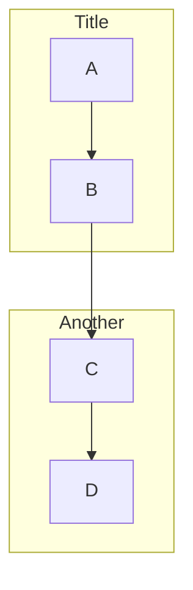
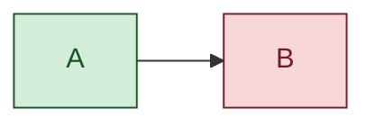

# Mermaid Syntax Reference

> Sources: mermaid.js.org/intro/syntax-reference.html, mermaid.js.org/syntax/ (retrieved May 2026, version 11.15.0)

This is the complete diagram type catalogue, keyword reference, and structural rules for Mermaid.

## Table of Contents

1. [General Structure](#general-structure)
2. [Flowchart](#flowchart)
3. [Sequence Diagram](#sequence-diagram)
4. [Class Diagram](#class-diagram)
5. [State Diagram](#state-diagram)
6. [Entity Relationship Diagram](#entity-relationship-diagram)
7. [Gantt Chart](#gantt-chart)
8. [Pie Chart](#pie-chart)
9. [Mindmap](#mindmap)
10. [Timeline](#timeline)
11. [GitGraph](#gitgraph)
12. [C4 Diagrams](#c4-diagrams)
13. [Other Diagram Types](#other-diagram-types)
14. [Directives and Theming](#directives-and-theming)

---

## General Structure

Every Mermaid diagram lives inside a fenced code block with the `mermaid` language identifier:

````
```mermaid
<diagram-type-keyword>
  <diagram body>
```
````

- The **first line** inside the block is the diagram type keyword (e.g., `flowchart LR`, `sequenceDiagram`, `classDiagram`).
- **Comments** use `%%` — everything after `%%` on a line is ignored.
- **Whitespace**: indentation is not significant for most diagram types (except `mindmap`), but improves readability. Use 2 or 4 spaces consistently.
- **Directives** (`%%{init: {...}}%%`) placed before the diagram keyword override configuration.

---

## Flowchart

**Keyword**: `flowchart` (or `graph` — both work, but `flowchart` supports newer features like subgraph direction overrides).

### Direction

Declared immediately after the keyword:

| Keyword | Meaning |
|---------|---------|
| `TB` or `TD` | Top to bottom (default) |
| `BT` | Bottom to top |
| `LR` | Left to right |
| `RL` | Right to left |

### Nodes

Nodes are declared by their ID, optionally followed by a shape bracket enclosing the label:

| Syntax | Shape |
|--------|-------|
| `A[text]` | Rectangle (process) |
| `A(text)` | Rounded rectangle |
| `A([text])` | Stadium / pill |
| `A[[text]]` | Subroutine |
| `A[(text)]` | Cylinder (database) |
| `A((text))` | Circle |
| `A>text]` | Asymmetric / flag |
| `A{text}` | Diamond (decision) |
| `A{{text}}` | Hexagon |
| `A[/text/]` | Parallelogram |
| `A[\text\]` | Parallelogram (alt) |
| `A[/text\]` | Trapezoid |
| `A[\text/]` | Trapezoid (alt) |
| `A(((text)))` | Double circle |

**v11.3.0+ extended syntax**: `A@{ shape: rect }` with 30+ named shapes including `cloud`, `doc`, `docs`, `cyl`, `diam`, `hex`, `tri`, `fork`, `bolt`, and more.

If the same ID appears multiple times, Mermaid reuses the existing node — it does not create a duplicate. This is how you create merging/branching flows.

**Markdown in labels**: Use `` ["`**bold** and *italic*`"] `` (double-quote then backtick).

**Unicode in labels**: Wrap in double quotes: `["日本語テキスト"]`.

### Edges (Arrows)

| Syntax | Meaning |
|--------|---------|
| `A --> B` | Solid arrow |
| `A --- B` | Solid line (no arrow) |
| `A -.-> B` | Dotted arrow |
| `A -.- B` | Dotted line |
| `A ==> B` | Thick arrow |
| `A === B` | Thick line |
| `A --x B` | Cross end |
| `A --o B` | Circle end |
| `A <--> B` | Bidirectional arrow |

**Edge labels**: `A -->|label text| B` or `A -- label text --> B`.

**Edge length**: extra dashes increase length: `A ---> B` (longer), `A ----> B` (even longer). Same applies for dotted (`-..->`), thick (`===>`).

**Edge IDs (v11+)**: `e1@A --> B` assigns the ID `e1` to the edge for later styling.

### Subgraphs



- `direction` inside a subgraph overrides the parent flowchart's direction.
- Subgraphs can link to other subgraphs or nodes.
- Nesting is supported but should be used sparingly.

### Styling



Individual node styling: `style A fill:#f9f,stroke:#333`.

### Interaction

`click A "https://example.com" "Tooltip" _blank` — makes a node clickable.

`click A callback "Tooltip"` — calls a JavaScript function.

---

## Sequence Diagram

**Keyword**: `sequenceDiagram`

### Participants

```
participant A as Alice
actor B as Bob
```

- `participant` renders as a box; `actor` renders as a stick figure.
- Declaration order determines left-to-right positioning.
- If not declared explicitly, participants are created in order of first appearance.

### Arrow Types

| Syntax | Meaning |
|--------|---------|
| `A ->> B: msg` | Solid line, solid arrowhead (synchronous) |
| `A -->> B: msg` | Dotted line, solid arrowhead (async response) |
| `A -) B: msg` | Solid line, open arrowhead (async fire-and-forget) |
| `A --) B: msg` | Dotted line, open arrowhead |
| `A -x B: msg` | Solid line with cross (lost message) |
| `A --x B: msg` | Dotted line with cross |

### Activation

```
A ->>+ B: Request     %% activates B
B -->>- A: Response    %% deactivates B
```

Or explicitly: `activate B` / `deactivate B` on separate lines.

### Control Flow Blocks

| Block | Purpose |
|-------|---------|
| `alt` / `else` | Conditional branches |
| `opt` | Optional block |
| `loop` | Repeated interaction |
| `par` / `and` | Parallel execution |
| `critical` / `option` | Critical region with fallback |
| `break` | Break out of a sequence |

All blocks end with `end`.

```
alt Successful payment
  API ->> DB: Save order
else Payment declined
  API -->> User: Show error
end
```

### Notes

```
Note right of A: Single participant note
Note over A, B: Spanning note
Note left of B: Left-side note
```

### Other Features

- `autonumber` — adds sequential numbers to messages.
- `rect rgb(200, 220, 255)` / `end` — background highlight region.
- `box Title` / `end` — groups participants visually.
- `create participant C` / `destroy C` — participant lifecycle within the sequence.

---

## Class Diagram

**Keyword**: `classDiagram`

### Class Definition

```
class Animal {
  +String name
  +int age
  +makeSound() void
  -sleep() void
}
```

Visibility prefixes: `+` public, `-` private, `#` protected, `~` package/internal.

Method notation: `methodName(params) returnType`.

Abstract and static: `methodName()* void` (abstract), `methodName()$ void` (static).

### Relationships

| Syntax | Meaning |
|--------|---------|
| `A <\|-- B` | Inheritance (B extends A) |
| `A *-- B` | Composition (A owns B) |
| `A o-- B` | Aggregation (A contains B) |
| `A --> B` | Association |
| `A ..> B` | Dependency |
| `A ..\|> B` | Realisation / Implementation |

Cardinality: `A "1" --> "*" B : has`.

Labels: `A --> B : relationship label`.

### Annotations

```
class Shape {
  <<interface>>
}
class Color {
  <<enumeration>>
  RED
  GREEN
  BLUE
}
```

### Namespaces

```
namespace Animals {
  class Dog
  class Cat
}
```

---

## State Diagram

**Keyword**: `stateDiagram-v2` (use v2 — the original `stateDiagram` lacks features).

### Transitions

```
[*] --> Idle
Idle --> Processing : start job
Processing --> Done : complete
Processing --> Failed : error
Done --> [*]
Failed --> [*]
```

`[*]` is the start and end pseudo-state.

### Composite States

```
state Processing {
  [*] --> Validating
  Validating --> Executing
  Executing --> [*]
}
```

### Forks and Joins

```
state fork_state <<fork>>
state join_state <<join>>
```

### Choice

```
state checkResult <<choice>>
Processing --> checkResult
checkResult --> Success : valid
checkResult --> Failure : invalid
```

### Notes

```
note right of Idle : Waiting for input
note left of Processing : May take up to 30s
```

### Concurrency

```
state Active {
  [*] --> Running
  --
  [*] --> Monitoring
}
```

The `--` separator creates concurrent regions.

---

## Entity Relationship Diagram

**Keyword**: `erDiagram`

### Relationship Syntax

```
ENTITY1 RELATIONSHIP ENTITY2 : "label"
```

**Cardinality notation** (read left side, then right side):

| Symbol | Meaning |
|--------|---------|
| `\|\|` | Exactly one |
| `o\|` | Zero or one |
| `}\|` | One or more |
| `}o` | Zero or more |

**Relationship line**:
- `--` identifying (child depends on parent for identity)
- `..` non-identifying (both exist independently)

```
CUSTOMER ||--o{ ORDER : "places"
ORDER ||--|{ LINE-ITEM : "contains"
PRODUCT }o..o{ ORDER : "included in"
```

### Attributes

```
CUSTOMER {
  int id PK
  string name
  string email UK
}
ORDER {
  int id PK
  int customer_id FK
  date created_at
  string status
}
```

Key markers: `PK` (primary key), `FK` (foreign key), `UK` (unique key).

---

## Gantt Chart

**Keyword**: `gantt`

```
gantt
  title Project Plan
  dateFormat YYYY-MM-DD
  axisFormat %b %d

  section Design
    Wireframes      :done, wire, 2025-01-01, 14d
    Visual Design   :active, vis, after wire, 21d

  section Development
    Frontend        :crit, fe, after vis, 30d
    Backend         :be, after vis, 25d
    Integration     :int, after fe, 10d

  section Launch
    QA              :qa, after int, 14d
    Deploy          :deploy, after qa, 3d
```

- `dateFormat` is mandatory.
- Task modifiers: `done`, `active`, `crit` (critical path).
- Dependencies: `after taskId`.
- Duration: `14d`, `3w`, or end date `2025-02-15`.
- `excludes weekends` — skip non-working days.

---

## Pie Chart

**Keyword**: `pie`

```
pie title Browser Share
  "Chrome" : 65
  "Firefox" : 15
  "Safari" : 12
  "Other" : 8
```

- `showData` directive displays values on slices.
- Values are proportional — they don't need to sum to 100.

---

## Mindmap

**Keyword**: `mindmap`

```
mindmap
  root((Central Idea))
    Topic A
      Subtopic A1
      Subtopic A2
    Topic B
      Subtopic B1
```

- **Indentation is significant** — it defines the hierarchy (unlike most other diagram types).
- Node shapes: `(Rounded)`, `[Square]`, `((Circle))`, `)Cloud(`, `{{Hexagon}}`.
- Icons: `::icon(fa fa-book)` after a node label.

---

## Timeline

**Keyword**: `timeline`

```
timeline
  title Product Evolution
  section 2023
    Q1 : Beta launch
       : Initial feedback
    Q3 : Public release
  section 2024
    Q1 : Mobile apps
    Q2 : Enterprise tier
```

- `section` groups time periods.
- Multiple events per period are separated by newlines with `:` prefix.

---

## GitGraph

**Keyword**: `gitGraph`

```
gitGraph
  commit id: "init"
  branch develop
  checkout develop
  commit id: "feat-1"
  branch feature/auth
  commit id: "auth-impl"
  checkout develop
  merge feature/auth
  checkout main
  merge develop tag: "v1.0"
```

- `commit` with optional `id:`, `tag:`, `type: HIGHLIGHT | REVERSE | NORMAL`.
- `branch name` / `checkout name` / `merge name`.
- `cherry-pick id: "commitId"`.
- Branch ordering: `order:` directive controls visual position.

---

## C4 Diagrams

**Keywords**: `C4Context`, `C4Container`, `C4Component`, `C4Dynamic`, `C4Deployment`.

```
C4Context
  title System Context
  Person(user, "Customer", "Places orders")
  System(web, "Web App", "Customer-facing UI")
  System_Ext(payment, "Payment Gateway", "Handles payments")
  Rel(user, web, "Uses", "HTTPS")
  Rel(web, payment, "Processes payments", "API")
```

- `Person`, `Person_Ext` — internal/external people.
- `System`, `System_Ext` — internal/external systems.
- `Container`, `Component` — at lower C4 levels.
- `Rel(from, to, label, technology)` — relationships.
- `Boundary(id, title)` / `end` — grouping.

---

## Other Diagram Types

### Quadrant Chart (`quadrantChart`)
Two-axis categorisation grid with four labelled quadrants and positioned items.

### XY Chart (`xychart-beta`)
Line and bar charts with `x-axis`, `y-axis`, `line`, and `bar` series.

### Sankey (`sankey-beta`)
Flow volume diagrams showing proportional transfers between nodes.

### Block Diagram (`block-beta`)
Spatial block layouts with `columns`, nested `block` groups, and directional arrows.

### Kanban (`kanban`)
Board with columns and cards, supporting metadata like `assigned`, `priority`.

### Architecture (`architecture-beta`)
System architecture layouts with groups, services, edges, and icon references.

### Requirement Diagram (`requirementDiagram`)
Requirements traceability with `requirement`, `element`, and relationship types.

### Radar (`radar`)
Spider/radar charts comparing multiple dimensions.

### Packet (`packet-beta`)
Network packet structure diagrams.

### ZenUML (`zenuml`)
Alternative sequence diagram syntax with a more code-like feel.

---

## Directives and Theming

### Init Directives

Placed before the diagram keyword to override configuration:

```
%%{init: {'theme': 'dark', 'flowchart': {'curve': 'basis'}}}%%
flowchart LR
  A --> B
```

### Available Themes

`default`, `dark`, `forest`, `neutral`, `base`.

`base` is the most customisable — combine it with `themeVariables` for full control:

```
%%{init: {'theme': 'base', 'themeVariables': {'primaryColor': '#ff6b6b', 'primaryTextColor': '#fff'}}}%%
```

### Key Theme Variables

- `primaryColor`, `secondaryColor`, `tertiaryColor` — node fills
- `primaryTextColor` — label text
- `primaryBorderColor` — node borders
- `lineColor` — edge colour
- `fontFamily` — typeface
- `fontSize` — base font size

### Accessibility

Use the `accTitle` and `accDescr` directives for screen reader support:

```
flowchart LR
  accTitle: Order Processing Flow
  accDescr: Shows how an order moves from placement through payment to fulfilment.
  A[Place Order] --> B[Process Payment] --> C[Fulfil Order]
```
